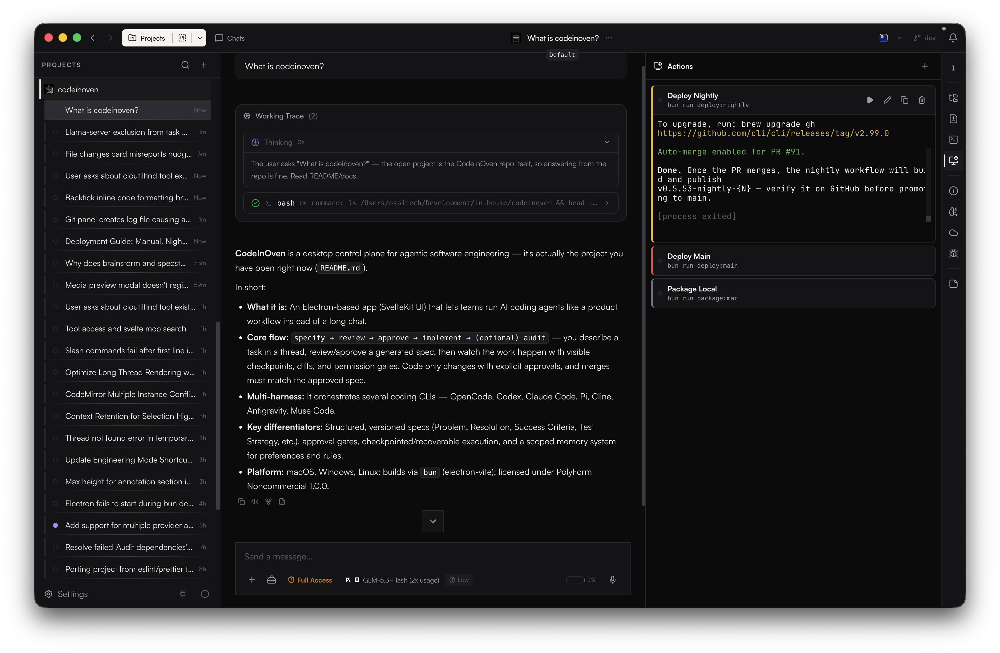
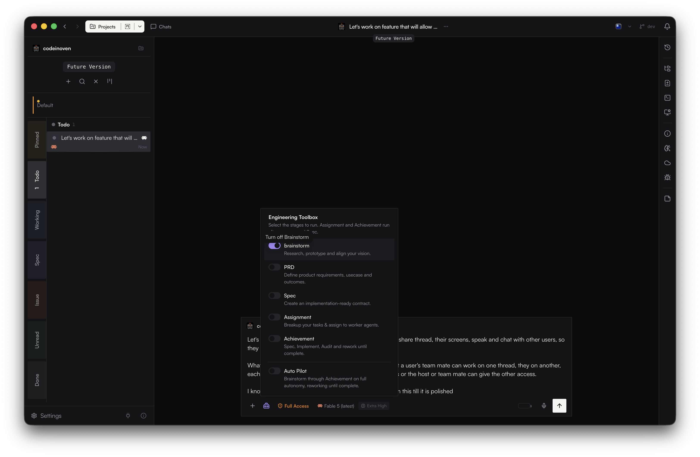
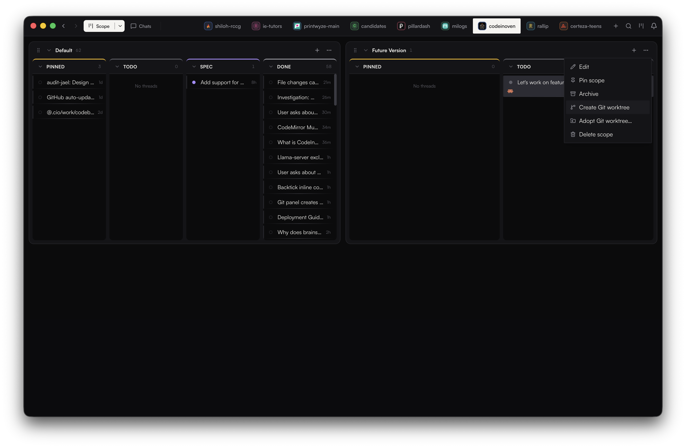

# CodeInOven

**A control plane for agentic software engineering that keeps work human-led, fast, and auditable.**

Website: [codeinoven.com](https://codeinoven.com) · [Support](SECURITY.md) · [Contributing](CONTRIBUTING.md) · [License](LICENSE)

[](https://github.com/pillardash-oss/codeinoven/actions/workflows/quality.yml)
[](https://github.com/pillardash-oss/codeinoven/actions/workflows/security.yml)
[](LICENSE)
[](package.json)

---

|  |
|---|
| <sub>Thread view with working trace, approvals, and side actions</sub> |

<table>
  <tr>
    <td width="50%"></td>
    <td width="50%"></td>
  </tr>
</table>
<table>
  <tr>
    <td width="50%"><sub>Engineering Toolbox</sub></td>
    <td width="50%"><sub>Scopes board</sub></td>
  </tr>
</table>

## What CodeInOven is for

CodeInOven helps teams run AI engineering work like a product workflow instead of a long chat:

- Describe a task once in a thread.
- Review and approve a plan before any code is changed.
- Watch the work progress with visible checkpoints, diffs, and permissions.
- Merge only when the result matches the approved spec.

It is designed as a starting point for software work, not a demo app.

## Quick start

1. Download the app from [GitHub Releases](https://github.com/pillardash-oss/codeinoven/releases) and install for macOS, Windows, or Linux.
2. Open a repository in **Projects**.
3. Start a new thread, choose your preferred coding harness, and describe your goal.
4. Review and approve the generated spec, then run implementation.

That is all you need to begin.

---

## Why people use it

- Predictability: no code changes without explicit approvals.
- Traceability: each decision and permission request is logged in the thread.
- Collaboration: multiple agents can work on one assignment without losing context.
- Reviewability: all changes are checkpointed, diffed, and explainable.

---

## In Depth Info

<details>
<summary>In Depth Info (technical and operational details, collapsed by default)</summary>

### Core workflow

```text
specify → review → approve → implement → (optional) audit
```

### What makes it different

- Structured and versioned specifications (`Problem`, `Resolution`, `Success Criteria`, `Test Strategy`, `Documentation`, `Commit Pattern`, `Constraints & Risks`).
- Multi-harness orchestration across supported coding CLIs.
- Explicit approval gates for permissions, spec changes, and implementation steps.
- Checkpointed execution with recoverability when threads are interrupted.
- Memory system for scoped preferences and rules.

### Requirements

- macOS, Windows, or Linux.
- One supported harness installed and authenticated.
- Git installed for repository operations.
- Node.js and Bun for source builds only.

### Supported harnesses

- OpenCode (`opencode`)
- Codex CLI (`codex`)
- Claude Code (`claude`)
- Pi (`pi`)
- Cline (`cline`)
- Antigravity (`agy`)
- Muse Code (`muse`)

### Installation (quick options)

From a terminal:

```bash
git clone https://github.com/pillardash-oss/codeinoven.git
cd codeinoven
bun install
bun run dev
```

Release builds are available for:

- macOS (`.dmg` / `.zip`)
- Windows (`.exe`)
- Linux (`.AppImage` / `.deb`)

### Data, privacy, and security

- App state is stored in OS config directories; your repo content is only modified through approved agent actions.
- Atomic file writes and branch-like checkpoints keep recovery reliable.
- Provider credentials are kept encrypted at rest through OS keychain-backed storage.
- Vulnerability reports: [GitHub private advisory](https://github.com/pillardash-oss/codeinoven/security/advisories/new) or `hey@pillardash.com`.

### Advanced workflows

- Assignment mode for larger work, with thread-level task decomposition.
- Achievement mode for near-autonomous execution within controlled tiers.
- Brainstorm mode for early option exploration.
- Independent audit passes for objective validation against the approved spec.

### Development and platform basics

- Runtime stack: Electron + Svelte 5 + TypeScript + Tailwind.
- Primary scripts:
  - `bun run dev`
  - `bun run build`
  - `bun run test [FILES]`
  - `bun run lint [FILES]`
- Packaging and release tooling are available under `bun run package:*` and `bun run release:*` commands.

### For Agents

<details>
<summary>For Agents (folded)</summary>

- Every thread follows a strict lifecycle and expects explicit stage transitions.
- Specs are the source of truth during planning and must be followed before implementation.
- Permission handling, scope rules, and memory writes are auditable and must be explicit in workflow logs.
- Do not skip approval gates or fabricate state mutations outside thread-owned operations.
- Prefer concise, reversible checkpoints and concise commit messages matching lifecycle expectations.

</details>

### Troubleshooting

- If a harness is not detected, verify the CLI is on `PATH` and authenticated.
- Use exported diagnostics when reporting issues.
- Thread recovery handles interrupted work on restart.
- Remote phone support is available through the built-in LAN pairing flow (QR) and optional relay mode.

### Packaging and release notes

- Releases are published via GitHub Actions.
- macOS release artifacts are currently Apple Silicon-first in automated workflows.

</details>

## License

CodeInOven is licensed under the [PolyForm Noncommercial 1.0.0](LICENSE) license.

You are free to use, modify, and redistribute CodeInOven for **personal, educational, and non-commercial** purposes. Commercial use — including use by companies or organizations in the course of business — requires a separate commercial license from [Pillardash Solutions Limited](mailto:sales@pillardash.com).
