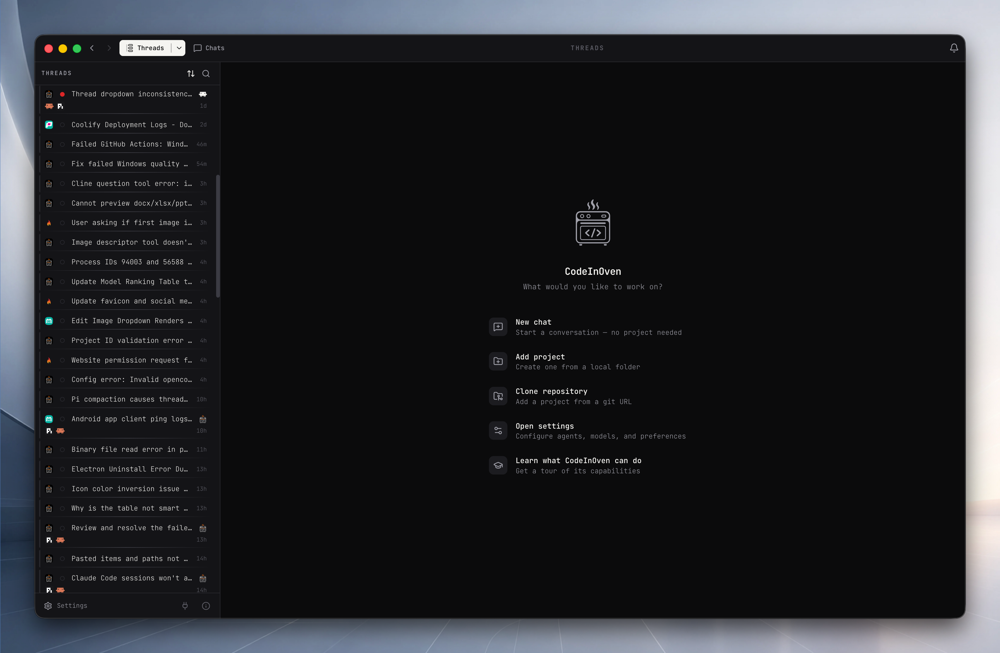
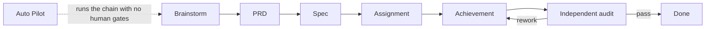

# CodeInOven

**Turn your agent into an engineer.**

CodeInOven is a free, open-source desktop workspace for coordinated agentic software engineering. It runs the coding agents you already have, keeps their plans and permissions reviewable, and lands the change in your real repository with a diff you can inspect and roll back.

Website: [codeinoven.com](https://codeinoven.com) · [Download](https://codeinoven.com/download) · [Contributing](CONTRIBUTING.md) · [Support](SECURITY.md) · [License](LICENSE)

[](https://github.com/pillardash-oss/codeinoven/actions/workflows/quality.yml)
[](https://github.com/pillardash-oss/codeinoven/actions/workflows/security.yml)
[](LICENSE)
[](https://github.com/pillardash-oss/codeinoven/releases/latest)

---

|                    |
| ---------------------------------------------------------------------------- |
| <sub>A thread with its working trace, tool calls, and permission cards</sub> |

<table>
  <tr>
    <td width="50%"></td>
    <td width="50%"></td>
    <td width="50%"></td>
  </tr>
</table>
<table>
  <tr>
    <td width="50%"><sub>Start Screen</sub></td>
    <td width="50%"><sub>Engineering Toolbox</sub></td>
    <td width="50%"><sub>Scopes board</sub></td>
  </tr>
</table>

## What it does

CodeInOven is the workspace around the agent, not another agent. Five things it handles so a long run stays reviewable:

- **It runs the agents you already trust.** Pi, Codex CLI, Claude Code, OpenCode, Cline, Antigravity, and Muse Code are detected on your machine and picked per thread. You are never locked to one.
- **It puts a lifecycle in front of implementation.** Brainstorm, PRD, Spec, Assignment, Achievement, and an independent audit, instead of one endless chat.
- **It keeps the run visible.** Reasoning, commands, file reads, diffs, and checkpoints stay on screen while the work happens.
- **It gives the agent real tools.** An attached terminal, an inner browser, a file explorer and editor, and a git panel that reviews pull requests and resolves merge conflicts.
- **It runs work that outlives a single session.** Scope-owned git worktrees, scheduled routines in Assistant view, and sub-agent fan-out for larger objectives.

## Quick start

1. Download from [codeinoven.com](https://codeinoven.com). Builds are served from our own mirror at `dl.codeinoven.com` under versionless links (`stable/codeinoven-arm64.dmg`, `stable/codeinoven-setup.exe`), with [GitHub Releases](https://github.com/pillardash-oss/codeinoven/releases) as a fallback. Scripts can read [`https://dl.codeinoven.com/stable/RELEASE.json`](https://dl.codeinoven.com/stable/RELEASE.json) for versions, sizes, and checksums.
2. Install it. Pi is bundled, so the app is useful before you install anything else.
3. Open a repository in **Projects**.
4. Start a thread, choose a harness and a model, and describe the goal.
5. Review the plan or spec, approve it, then run implementation.

## The engineering lifecycle

Stages are switches on a thread, in the Engineering Toolbox. Enable any combination and the engine runs them in canonical order, skipping the ones you left off. A stage that finishes turns its own switch off and parks the rest, so in a manual run the next stage only starts when you press its button. Auto Pilot, and a manual run that includes Achievement, keep chaining instead, because the audit and rework loop has to drive the pipeline forward.



| Stage       | What it produces                                                                         |
| ----------- | ---------------------------------------------------------------------------------------- |
| Brainstorm  | Research, decisions, and optional Lo-Fi or Hi-Fi prototypes for a rough idea             |
| PRD         | A versioned product requirements document with goals, non-goals, and acceptance criteria |
| Spec        | An implementation-ready contract you approve before any code is written                  |
| Assignment  | A reviewable task graph, with worker threads that can each run in their own worktree     |
| Achievement | Spec, implement, audit, and rework in a loop until the goal passes or fails hard         |
| Auto Pilot  | The whole chain with nobody answering gates                                              |

Audit is a pass rather than a switch. It can run against a Spec, or against the conversation itself when there is no Spec, and it reports independently of the agent that wrote the code.

Full contract: [`docs/ENGINEERING-LIFECYCLE.md`](docs/ENGINEERING-LIFECYCLE.md).

## Harnesses

CodeInOven probes for each of these and drives the newest one it finds. Pi ships inside the app; the rest come from your own install, and the app hands you the vendor's install, update, or uninstall command rather than changing your machine quietly.

| Harness     | Command        | Custom base-URL providers |
| ----------- | -------------- | ------------------------- |
| Pi          | `pi` (bundled) | yes                       |
| Codex CLI   | `codex`        | yes                       |
| Claude Code | `claude`       | yes                       |
| OpenCode    | `opencode`     | yes                       |
| Cline       | `cline`        | yes                       |
| Antigravity | `agy`          | no                        |
| Muse Code   | `muse`         | no                        |

OpenCode is one entry, not two. The app probes `opencode` and `opencode2`, keeps the newest, and drives the transport that matches it, so V1 and V2 machines both work without a version picker.

You do not have to write an `AGENTS.md` or `CLAUDE.md` first. CodeInOven supplies the engineering behavior from its own prompt layer, which you can edit in Settings, and a harness that reads those files natively still gets them when they exist.

## Models

Models come from the harness you choose, so anything that agent supports is available here. On top of that, CodeInOven speaks OpenAI-compatible and Anthropic-compatible endpoints, which covers a private cloud and the local servers you are already running:

- Ollama at `http://localhost:11434/v1`
- LM Studio at `http://localhost:1234/v1`
- llama.cpp at `http://localhost:8080/v1`
- anything else with a base URL and a model name

Keys are stored in a vault encrypted through the OS keychain (`secrets/vault.json` under the config root). Requests go straight from your machine to the provider you chose. CodeInOven hosts no relay of its own and never sees the key.

## What is in the workspace

| Surface                              | What it gives you                                                                                                                                                                                                                                                                                                                              |
| ------------------------------------ | ---------------------------------------------------------------------------------------------------------------------------------------------------------------------------------------------------------------------------------------------------------------------------------------------------------------------------------------------- |
| Threads and the working trace        | Reasoning, tool calls, and file reads as they happen, permission cards you answer in place, and a final answer you can quote from                                                                                                                                                                                                              |
| Scope board                          | Projects, threads, and scopes organized into Pinned, Todo, Working, Spec, Issue, Unread, and Done columns                                                                                                                                                                                                                                      |
| Managed git worktrees                | A scope can own a worktree with its own branch, setup commands, and environment mode. Health, repair, and destructive actions are guarded by a confirmation that checks for dirty files and unpushed commits first                                                                                                                             |
| Terminal                             | A real shell attached to the active scope root, docked in the workspace or fullscreen                                                                                                                                                                                                                                                          |
| Inner browser                        | A per-project isolated session for testing a running app and reading docs, which the agent can also drive through `cio:browser`. Manual browsing and agent-driven tabs share that one isolated session, so a sign-in survives across threads and runs, and the app exposes no raw-cookie interface. It runs with no preload and no Node access |
| File explorer and editor             | Browse the scope, open files, edit in place                                                                                                                                                                                                                                                                                                    |
| Git panel                            | Branches, stashes, staging, commits, and diffs, plus GitHub pull request review with conversation, checks, and merge dialogs, and a merge-conflict editor for the branches the agent produced                                                                                                                                                  |
| Assistant view                       | Routines and tasks that run agents on a schedule, one fresh thread per run, with missed-run detection, connection picks, an agent-authored how-to, and hand-off of a task into a project                                                                                                                                                       |
| Design and video authoring           | Agents build HTML prototypes into the design studio and cut compositions into the video studio, with preview and frame capture                                                                                                                                                                                                                 |
| Speech                               | Local dictation, spoken replies, and cleanup through locally downloaded models. See [`docs/SPEECH.md`](docs/SPEECH.md)                                                                                                                                                                                                                         |
| Computer use                         | Supported models drive desktop interfaces through the computer-use bridge to verify their own work, with a picture-in-picture control surface                                                                                                                                                                                                  |
| Sub-agents, checkpoints, diagnostics | Delegated sub-agents appear as child-agent cards with their own sessions, selective checkpoint rollback puts a thread back to an earlier state, and Settings exports a redacted diagnostics bundle                                                                                                                                             |
| Utilities                            | MCP servers, skills, and web services the agents activate on demand, installed and managed from Settings                                                                                                                                                                                                                                       |

## Data and privacy

- All app state lives under the config root, `~/.config/pillardash/codeinoven/`: projects, threads, specs, history, checkpoints, memory, routines, and speech models.
- The repository is changed only by agent actions you approve, or by your own edits in the file editor and git panel. State writes are atomic (`.tmp` then rename), history is chunked, and thread counts are capped.
- Provider credentials are encrypted at rest through the OS keychain. Harness-native logins (for example a Claude or Codex sign-in) stay in that harness's own credential store, where they already live.
- Nothing routes through CodeInOven's servers. Report a vulnerability through the [GitHub private advisory](https://github.com/pillardash-oss/codeinoven/security/advisories/new) or `hey@pillardash.com`.

## Build from source

Requirements:

- Bun `>=1.3.14` (the toolchain for this repository)
- Node `>=22.13.0`
- Git

Electron `^44.4.5` is installed as a dependency, so you do not install it yourself. The stack is Electron, Svelte 5, TypeScript, and Tailwind v4.

```bash
git clone https://github.com/pillardash-oss/codeinoven.git
cd codeinoven
bun install
bun run dev
```

`bun install` runs the repository's postinstall (Electron binary, binary patches, native app deps), and `bun run dev` builds the local speech workers and brands Electron before starting.

### Verify

Run these scoped to the files you touched. Passing paths keeps them fast.

| Purpose               | Command                  |
| --------------------- | ------------------------ |
| Type and Svelte check | `bun run check [FILES]`  |
| Lint                  | `bun run lint [FILES]`   |
| Format                | `bun run format [FILES]` |
| Tests                 | `bun run test [FILES]`   |
| Everything, repo-wide | `bun run verify`         |

`bun run verify` runs check, lint, the full test suite, and a dependency audit. `bun run verify:release` adds a production build and the bundle-budget check.

### Package

`bun run package` builds an unpacked app for your machine. Per-platform builds are `package:mac`, `package:win`, and `package:linux`. Publishing goes through CI; see [`docs/RELEASE_CHECKLIST.md`](docs/RELEASE_CHECKLIST.md).

Builds Apple Silicon macOS (`.dmg` and `.zip`), x64 Windows (`.exe`), and x64 Linux (`.AppImage` and `.deb`). Intel macOS is not a supported target.

## Troubleshooting

**Windows on ARM: `bun install` fails with `ffmpeg-static install failed: No binary found for architecture`.** `ffmpeg-static` ships no Windows on ARM binary: its module allows Windows x64 and ia32 only, so it resolves to no binary on arm64 and the installer stops there. Install without the dependency install scripts, run the repository's own postinstall, and place an ffmpeg binary where the app looks for one:

```powershell
bun install --ignore-scripts
bun run postinstall
```

Download an x64 Windows ffmpeg build from [gyan.dev](https://www.gyan.dev/ffmpeg/builds/) or [BtbN builds](https://github.com/BtbN/FFmpeg-Builds/releases), then copy `ffmpeg.exe` to `node_modules\ffmpeg-static\ffmpeg.exe`. That is one of the paths `resolveFfmpegPath` checks (`src/main/speech/ffmpeg-path.ts`), so local audio decoding finds it.

`better-sqlite3` needs nothing extra on Windows on ARM. Version 13 ships a `win32-arm64` prebuild.

**A harness is not detected.** Check that its CLI is on `PATH` and authenticated by running its command in your own terminal. The Harnesses page shows the version CodeInOven probes and the vendor's own install command for your platform.

**An interrupted run does not always resume by itself.** After a restart, thread recovery reopens work that was interrupted. If you pressed Stop, automatic resume stays quiet until your next message, because that latch survives restarts. See [`docs/ENGINEERING-LIFECYCLE.md`](docs/ENGINEERING-LIFECYCLE.md).

**Something is wrong and you want to report it.** Settings exports a redacted diagnostics bundle, bounded in size, with no credentials in it.

## Documentation

| Document                                                                         | Covers                                                                             |
| -------------------------------------------------------------------------------- | ---------------------------------------------------------------------------------- |
| [`docs/APP-BIBLE.md`](docs/APP-BIBLE.md)                                         | Product philosophy, design system, engineering standards. This one wins conflicts. |
| [`docs/ENGINEERING-LIFECYCLE.md`](docs/ENGINEERING-LIFECYCLE.md)                 | Stage order, human gates, Assignment workers, Auto Pilot, recovery                 |
| [`docs/ASSISTANT-VIEW.md`](docs/ASSISTANT-VIEW.md)                               | Routines, tasks, scheduled runs, missed runs, hand-off                             |
| [`docs/GIT-WORKTREES.md`](docs/GIT-WORKTREES.md)                                 | Scope-owned worktrees, setup, health, destructive lifecycle                        |
| [`docs/EMBEDDED_BROWSER_ARCHITECTURE.md`](docs/EMBEDDED_BROWSER_ARCHITECTURE.md) | Inner browser, its trust boundaries, and its lifecycle                             |
| [`docs/SPEECH.md`](docs/SPEECH.md)                                               | Local speech runtimes, model catalog, dictation, cleanup                           |
| [`docs/SECRETS.md`](docs/SECRETS.md)                                             | Release signing and local development secrets                                      |
| [`docs/DOWNLOAD-MIRROR.md`](docs/DOWNLOAD-MIRROR.md)                             | Mirror layout, publishing, verification, terminal downloads                        |
| [`docs/RELEASE_CHECKLIST.md`](docs/RELEASE_CHECKLIST.md)                         | Release readiness                                                                  |
| [`CONTRIBUTING.md`](CONTRIBUTING.md)                                             | Ground rules, definition of done, verification, git discipline                     |

## License

CodeInOven is open source under the [MIT License](LICENSE). It is a product of [Pillardash Solutions Limited](https://pillardash.com).
