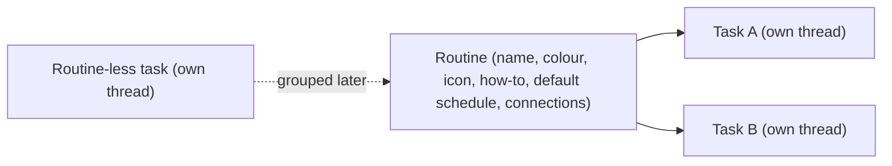

# Assistant View

Assistant View is a top-level view alongside Projects and Chats. It holds
**routines** and **tasks**, schedules agent runs, and hands task threads off to
projects. This document is the contract for the assistant model, the scheduler,
the missed-run surfaces, the how-to authoring flow, and fork hand-off.

## Model

- **Routine** is the group ("Triage CodeInOven PRs daily, 9am and 5pm"). It owns
  the agent-authored how-to, a default schedule, and connection picks. Type:
  `src/lib/types/routine.ts`; persisted in the `routines` table via
  `src/main/database/repositories/routine-repo.ts` and managed by
  `src/lib/engines/routine-manager.ts`.
- **Task** is a thread in the hidden assistant space container
  (`ASSISTANT_SPACE_ID`, `src/lib/types/project.ts`) with an optional
  `routineId`. One continuous thread per task; a task may exist without a
  routine. Assistant threads are excluded from Projects and Chats because the
  container is a hidden project, exactly like the inbox.
- **Hierarchy is always Routine -> Task -> one continuous thread per task.**
  Each task may override its routine's schedule (`scheduleOverride`), and shows a
  custom icon (`assistantIconType`) on its row.

### V1 pillars

1. Core view + how-to panel (`src/renderer/lib/components/assistant/`).
2. Main-process scheduler with missed-run detection
   (`src/main/scheduler/routine-scheduler-service.ts`).
3. Agent-authored how-to flow (in-thread authoring, `/save-how-to`).
4. Fork hand-off to a project, from the task's own context menu
   (`assistant-handoff.svelte.ts`, `AssistantHandoffModals.svelte`).

### Explicitly deferred

Thread-per-run, automatic catch-up of missed schedules, a standalone Task
entity, a new `threadKind` flag, hand-off by move (not fork), and a permanent
general assistant chat. The header's **New task** action creates a routine-less
task instead, and creates it with no extra naming step.

### Workspace

A routine behaves like a project, so its tasks run inside the routine's own
workspace instead of a shared scratch directory:

- The assistant container itself is hidden with no path, like the inbox. When a
  session needs a directory, `resolveProjectPath`
  (`src/main/chat/chat-engine.ts`) maps it to the app-storage root
  `assistant-cwd/`.
- `resolveThreadPath` then scopes every assistant thread to
  `assistant-cwd/<routineId>/`, so work in one routine can never touch another's
  files. A routine-less task gets `assistant-cwd/<threadId>/`.
- That routine directory is the session's working directory and its permission
  project root, so artifacts, generated images, and any files the agent writes
  land under the routine. Assistant threads get no `chats-artifacts` scratch
  path, and `assistant-cwd` is registered as an app artifact root so the
  renderer can show those files.
- The rail's **Workspace files** panel mounts the file tree on exactly that
  directory: `assistantThreadWorkspaceDirectory` (`src/lib/project-artifacts.ts`)
  builds the same `assistant-cwd/<routineId ?? threadId>` path for both the
  session and the file surfaces, and `ProjectFilesRootResolver`
  (`src/main/editor/project-files/project-files-roots.ts`) resolves it through
  the assistant mount built by `createThreadWorkspaceRoots`
  (`src/main/editor/project-files/thread-workspace-roots.ts`). Previews of those
  files are served from `appfile://thread/assistant/<threadId>/<path>`, so a
  task only ever previews inside its own routine's workspace.
- Directory constants live in `src/lib/project-artifacts.ts`
  (`ASSISTANT_CWD_DIR`, `CHATS_CWD_DIR`) and are pre-created by
  `src/main/storage/storage-engine.ts`.

## Scheduler contract

`RoutineSchedulerService` (`src/main/scheduler/routine-scheduler-service.ts`) is
the app's clock for Assistant View.

- **App-open-only firing.** A bounded 30s tick evaluates each scheduled task.
  A slot that comes due while the app is open dispatches one run on the task's
  continuous thread, using the task's bound settings and the routine how-to as
  prompt context (`sendPrompt` with `origin: 'internal'`).
- **Paused routines never fire.** `Routine.paused` is checked before the
  schedule is even read (`RoutineManager.isTaskPaused`), so pausing a routine
  stops every task in it while keeping the tasks, their how-to, and their
  history. Resume from the panel's **All** tab. A routine-less task is never
  paused.
- **No auto catch-up.** A slot that came due while the app was closed (or a
  machine slept through it) is recorded as a missed run, never run in a burst.
  The grace window is `MISS_GRACE_MS`; a fire before process start is always a
  miss.
- **Missed-run persistence.** `MissedRunStore`
  (`src/main/scheduler/missed-run-store.ts`) writes
  `scheduler/missed-runs.json` through the storage engine. Records are
  idempotent by `(threadId, dueAt)`, so repeated relaunches cannot
  double-count or double-badge one miss.
- **Dismiss vs Run Now.** `assistant:dismissMissedRun` acknowledges a record
  without running it; `assistant:runMissedRunNow` dispatches the run on the task
  thread and settles the record on success. Neither is automatic.

## Missed colour token

The missed surfaces use a dedicated token, never `--color-warning` (`#d97706`),
and never `#ffe300` verbatim (it fails text contrast on light surfaces).

| Theme                                      | Token            | Value     | Contrast                             |
| ------------------------------------------ | ---------------- | --------- | ------------------------------------ |
| Light (`@theme` in `src/renderer/app.css`) | `--color-missed` | `#a16207` | ~4.9:1 on `#ffffff` (AA normal text) |
| Dark (`.dark` in `src/renderer/app.css`)   | `--color-missed` | `#fcd34d` | ~13.6:1 on `#0b0b0d`                 |

The token joins the other thread tones in `STATUS_TONE_COLORS`
(`src/renderer/lib/stores/scope-board.ts`) as `missed: 'var(--color-missed)'`,
with the tone added to `ThreadStatusTone`
(`src/lib/thread-status-policy.ts`). No thread status maps to it: it exists only
for assistant scheduled runs. `StatusBadge.svelte` resolves it automatically.

## Missed-run surfaces

Missed runs are surfaced **per routine**: a routine's surfaces list every miss
across its tasks, and a routine-less task lists only its own. Nothing appears
until a run has actually been missed, so no tab or filter chrome exists by
default:

- the **Issues** tab of the assistant panel, present only when the panel's
  routine (or task) has a miss or a run problem;
- the **missed badge** on the routine row (when any child task has a miss) and on
  the specific missed task row;
- the **Missed Runs section** of the notification panel (`Assistants` tab),
  grouped per routine, with per-entry **Dismiss** and **Run now** actions. The
  Assistants tab exposes no sub-filter buttons; with no miss it shows only a
  neutral empty state.

The renderer state lives in `assistantRoutines`
(`src/renderer/lib/stores/assistant-routines.svelte.ts`), fed by the
`routine:changed` and `assistant:missedRunsChanged` events.

## Assistant sidebar

The left sidebar shows only routines and their tasks, with no title header and
no composer. Everything the view offers lives on the app header, registered by
the workspace through `viewActions`:

- **Search** (`AssistantSearchControl.svelte`) filters routines and tasks.
- **New routine** (`RoutineCreateControl.svelte`) names a routine and
  immediately seeds its first task, exactly as adding a project opens a first
  thread; the how-to panel opens next.
- **New task** creates a task, and is routine-aware: when the user is inside a
  routine (the selected task belongs to one, or its how-to panel is docked) the
  task is created inside that routine; otherwise it is routine-less.

Keyboard shortcuts mirror the header actions and are scoped to the Assistant
view, so they never steal the chords from Projects or Chats:

- **Cmd/Ctrl+N** — new task (inside the routine the user is currently in, else
  routine-less).
- **Cmd/Ctrl+Shift+N** — new routine, always.

Both signals travel through `workspaceState.requestAssistantTask()` and
`requestAssistantRoutine()` and are consumed by the workspace, which owns the
routine-aware creation logic.

Routine rows (`AssistantRoutineRow.svelte`) follow the project folder row: the
icon swaps to a chevron on hover, and hover reveals a search-in-routine control,
a new-task button, and an ellipsis menu (also opened by right-clicking the row)
with How to, Edit routine, Pin/Unpin, and Remove. Rows are draggable to reorder, and a
task dragged onto a routine is grouped into it. Hovering a routine reveals a
popover with its status, schedule type, next run, task count, and a how-to
preview (`AssistantRoutineHoverPopover.svelte`).

Routines are editable exactly like projects: **Edit routine**
(`RoutineEditModal.svelte`) opens the shared `AppearancePicker` for the accent
colour and SVG icon, an **Upload Image** action for a custom icon, and the
routine name. Custom icons are stored under `routines/<routine-id>/` through the
shared `src/lib/icon-file.ts` helpers (the same ones project icons use), served
back by `routine:getIcon`, and cached on `assistantRoutines.iconUrls`. A routine
row resolves its icon as custom image, then SVG icon type tinted with the accent
colour, then the generic routine icon; the accent colour stays as the row's left
border.

Task rows (`AssistantTaskRow.svelte`) behave exactly like thread rows. Hovering
reveals an ellipsis (overlaid, so the title truncates at the full row width)
whose menu is the shared `createThreadActionsMenu`: Rename, Pin/Unpin, Fork,
Notes, Copy thread id, and Delete. Right-clicking the row opens the same menu,
a long press opens it on touch, and hovering shows the regular
`ThreadHoverPopover` (with the hidden assistant container's project rows
suppressed via `hideProject`). A new task is created already inside its routine
(`routineId` travels through `thread:create`), so the creation broadcast can
never leave it stranded outside the routine.

The how-to panel opens in the right context sidebar from the rail's **How to**
toggle or a routine's **How to** menu item. An assistant thread's rail carries
the conversation tools only: **History**, **How to**, **Workspace files**
(mounted on the task's own workspace directory), **Sources** and **Memory**, plus
**Debugger** in development builds. It never carries terminal, actions, changes
or cloud tools.

Memory is scoped by **audience**, never by one flat scope word. An entry
carries a scope set that either names audiences (**Projects**, **Chats**,
**Assistants**, with an empty set meaning every audience) or pins itself to
exactly one place (`project`, `thread`, `routine`, `task`). The scope control is
a multi-select that mirrors the projects picker: an **All audiences** row plus
one toggle per scope (`MemoryScopeSelect.svelte`), and the set is stored as
`scopes:` metadata on the entry in its own memory file. `memory-scopes.ts`
(`src/lib/memory/memory-scopes.ts`) owns those rules, and both the engine and the
panel read them from there instead of re-deriving them.

Where an entry lives follows from its set: audience-level entries live in their
audience's own file (the root memory file for the projects audience or a mix of
audiences, the inbox file for chats, the assistant container's file for
assistants), a `project`/`thread` entry lives in that project's or thread's
file, a `routine` entry lives in the assistant container's file keyed by
`routineId`, and a `task` entry lives in that task's thread file.

Memory on an assistant task uses the `sidebar-assistant` surface
(`src/renderer/lib/components/memory/memory-routing.ts`), which pins the project
to the hidden assistant container instead of a pickable project and offers the
assistant's three scopes: **Assistant** (the assistant container's own file,
which reaches every task), **Routine** (this task's routine, whose entries live
in that same file keyed by `routineId`) and **Task** (this task's own thread
file). The panel shows an entry only when its scope set applies to assistants,
which is exactly what the engine loads: `MemoryService.current`
(`src/main/chat/memory-service.ts`) resolves the task's `routineId` from the
thread record and filters the container file by it, so one routine can never
receive another routine's memory, and a project-only or chat-only entry never
reaches an assistant task.

## How-to authoring

Every routine has a required how-to. The UI **never** uses the term "system
prompt"; the user-facing term is how-to.

- A routine shows an amber **Incomplete** icon (`AlertTriangle`,
  `--color-warning`) whenever it cannot run yet, with the exact gap on hover.
  `routineGap` (`assistant-view.ts`) is the single source for that rule and names
  what is missing ("Needs a how-to and a model"); the missed state uses the same
  icon in `--color-missed`. Routine rows never carry the state as text, and the
  badge shares the second row with the task count. The sidebar, the hover
  popover, and the search results all read the same helper, so they cannot
  disagree.
- The how-to is authored conservatively in the routine's task thread, never in
  a panel. The first task's head start asks _how the routine should happen_ and
  the user describes it; the agent works out what it needs, asks about anything
  missing, and drafts the how-to with them.
- The routine's seed task is its **Getting started** thread. It carries a fixed
  title (`ASSISTANT_SETUP_TITLE`) and is never auto-titled, and it runs no
  auxiliary work: `isAssistantSetupThread` gates the engine so prompt-derived
  titles and memory extraction are skipped, and a `propose_memory` call answers
  `memory_unavailable`. Its first exchange therefore stays a pure authoring
  conversation instead of being mined as a task run. The flag is persisted on
  the thread (`assistant_getting_started`, with a migration for existing
  databases), so it survives reloads and regroups.
- The authoring contract asks for **two** fenced blocks once the user agrees:
  the how-to itself (tag `how-to`) and a machine-readable plan (tag `routine`)
  carrying `cadence`, `times`, `weekdays`, and `connections`. The user then sends
  `/save-how-to`, which commits all three: the instructions, the schedule, and
  the connections.
- The user never hand-builds a schedule. `parseRoutinePlan` turns the plan block
  into a `RoutineSchedule`, accepting `8`, `8:30`, `8am`, `8:30 pm` and `18:00`
  as times, full or abbreviated weekday names, and a free-text
  `schedule: every day at 8:05am` line. A phrase it cannot parse ("Monday to
  Friday") contributes nothing rather than silently changing the cadence.
  `connectionsFromPlan` links each named service to a library utility when one
  matches, and otherwise records it as a required connection the panel shows as
  needing setup.
- Draft detection is deliberately tolerant, because the commit command has to
  work against how a model actually formats the block, not only the contract.
  `extractHowToDraft` and `extractRoutinePlanDraft` in `assistant-view.ts`
  accept both a fence tagged with the block name (optionally with a
  `: <title>` suffix) and a bare fence whose first line is a `how-to:` or
  `routine:` marker, strip that marker line, and take the newest matching block
  in the newest assistant message. Every other fenced block is ignored, and a
  block that is only a marker line is not a draft. Blocks are matched by fence
  nesting rather than to the first closing fence, so a how-to that carries its
  own command fence (a `bash` example inside the instructions) is kept whole
  instead of being silently truncated, and prose written after a block stays out
  of the saved content.
- When a routine lacks the utilities it needs, the agent checks the app utility
  library, researches compatible skills/MCPs/plugins, and asks the user to send
  `@cio-utility proceed` before anything is installed. No silent installs; the
  only acceptable blockers are network and a closed app.

## Assistant panel

`AssistantPanel.svelte` is the routine's whole surface, docked in the right
context sidebar and openable full screen from its own header button. It is
read-only where the app must own the value and editable where the user must.

- **All** — pause or resume the routine, plus one summary row per section with
  the state in one line and a **More** button that opens that tab. An amber icon
  marks each section that still needs setup. Under the pause toggle sits **Run
  now**, which dispatches the routine's tasks immediately regardless of its
  schedule and pause state, so a routine can be tested before its next fire;
  beneath it are **Last run** and **Last success**. Last run is the last
  dispatch, and last success is stamped when a run's turn actually settles
  (`RoutineSchedulerService.settleRun` records `lastSuccessAt` only for a task
  the scheduler dispatched a run on, so a user's own chat never counts as a
  run), with both timestamps read across the routine's tasks.
- **Routine** — the saved how-to, parsed into foldable sections by
  `parseHowToSections`. It recognises markdown headings and the ALL-CAPS title
  style the agent actually writes (`DRAIN PROCEDURE (0600 and 1800)` is a title;
  an indented numbered line is not), never splits inside a fenced code block, and
  round-trips through `serializeHowToSections`. Each section is edited on its own
  with `RichMarkdownEditor` and rendered with `MarkdownView`. The schedule appears
  here as a read-only line: the agent sets it from the plan block, so no manual
  schedule editor exists anywhere in the app.
- **Connections** — the routine's utilities, resolved against the connection
  library by `resolveConnections`. Each row carries its kind and a **Ready / Off /
  Incomplete / Needs setup** state with the reason: a connection the library does
  not carry, a switched-off utility, an MCP with no command or URL, and an MCP
  whose declared `{env:NAME}` secret was never supplied all read as needing setup
  instead of as working. **Add a connection** is a searchable, full-width library
  picker (`UtilityPicker.svelte`), never a plain select, and a half-configured row
  links straight to the Utilities page.

  The library is the same union the Utilities page renders, built by
  `buildConnectionLibrary` in `connection-library.ts`: the registry utilities the
  user installed **plus** the MCP servers and skills the active harness discovers
  on disk, addressed with a `capability:` prefix so a discovered capability's id
  can never collide with a registry id. Loading only the registry made the picker
  look half empty next to the page it points the user at. A capability whose
  source is the registry itself is skipped, since the registry record is the one
  the user can configure, and the same skill discovered by several harnesses is
  collapsed to one row with the app-owned or global copy winning.

  A discovered capability has no registry config to inspect, so it resolves as
  ready once it is switched on and carries a transport; an MCP with no command or
  URL still reads as incomplete.
- **Agents** — one primary model and any number of fallbacks, each picked with
  the app's `ModelPicker` so thinking level and account stay visible
  (`RoutineAgentPicker.svelte`). Creating a routine prompts for a primary and two
  fallbacks; more can be added here, and any row can be removed again, so a set
  can shrink back to the primary alone. The primary is prefilled with the model the
  user is already working on (`currentAssistantModelSelection` in the
  workspace), and `withDefaultRoutinePrimary` (`src/lib/routine-agents.ts`)
  applies the same fallback when the dialog is skipped, so a routine never blocks
  on an empty model set.

### How the model set is used at run time

The model set is not decoration; it decides which model a run executes on.

- A scheduled dispatch overlays the routine's **primary** onto the task's thread
  settings (`routinePrimaryModel` + `settingsWithRoutineModel` in
  `src/lib/routine-agents.ts`), so the models picked for a routine are the models
  its runs use. A routine with no model set keeps the task's own settings.
- A task created inside a routine is seeded on the routine's primary, so the
  composer shows the model the routine actually runs on.
- When a run hits a **provider failure**, the chat engine moves the task onto the
  routine's next model and re-runs at once, instead of parking the thread for the
  failed provider's reset window (`tryAssistantModelFallback` in
  `src/main/chat/chat-engine.ts`, fed by `RoutineManager.resolveTaskAgents`). The
  order comes from `routineModelCandidates`, so the primary is tried first and the
  fallbacks after it, in the order they are listed.
- Fallover stops at the end of the list: once every model has failed, the normal
  reset wait and the **Issues** tab take over. A model the user picked by hand,
  which is not part of the routine's set, is never overridden.
- **Issues** — missed runs with **Dismiss** and **Run now**, plus task-level run
  problems: a rate limit with its retry time, a failed run, and an interrupted
  run. Every entry opens its task.

## Fork hand-off

Hand-off lives on the **task's own context menu** ("Hand off to project"), never
in the panel. `createAssistantHandoff` (`assistant-handoff.svelte.ts`) forks the
thread into a chosen project via `thread:fork`
(`src/lib/engines/thread-manager-fork.ts`), reusing the `ContinueInProjectModal`
picker; `AssistantHandoffModals.svelte` renders that picker and the mid-run
confirmation. The fork is seeded with `handoffSummary` (recorded with
`history:append`), and the original task thread and its schedule stay intact.
Handing off while the task is mid-run always passes a confirmation dialog first,
so a concurrent write cannot corrupt the thread session.
