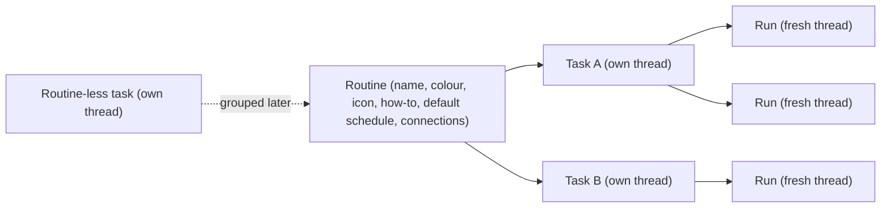

# Assistant View

Assistant View is a top-level view alongside Projects and Chats. It holds
**routines** and **tasks**, schedules agent runs, and hands task threads off to
projects. This document is the contract for the assistant model, the scheduler,
the missed-run surfaces, the how-to authoring flow, and fork hand-off.

## Model

- **Routine** is the group ("Triage CodeInOven PRs daily, 9am and 5pm"). It owns
  the agent-authored how-to, a default schedule, and connection picks. Type:
  `src/lib/types/routine.ts`; persisted in the `routines` table via
  `src/main/database/repositories/routine-repo.ts` and managed by
  `src/lib/engines/routine-manager.ts`.
- **Task** is a thread in the hidden assistant space container
  (`ASSISTANT_SPACE_ID`, `src/lib/types/project.ts`) with an optional
  `routineId`. It is the user's own conversation about the task; a task may
  exist without a routine. Assistant threads are excluded from Projects and
  Chats because the container is a hidden project, exactly like the inbox.
- **Run** is one execution of a task, on its **own fresh thread**. Every
  scheduled fire, missed-run **Run now**, and routine **Run now** creates one,
  so a run never lands in the task's conversation and a run's transcript carries
  only that execution. A run thread is a thread like any other (it can be
  renamed, pinned, forked, noted, handed off, and deleted), it inherits its
  task's `routineId` so the engine keeps composing the routine's how-to and run
  contract into its system prompt, and it links back through
  `Thread.assistantTaskId` (`isAssistantRunThread`). **Only a routine's Getting
  started thread hosts the getting-started run** the authoring conversation
  and no task's scheduled run ever executes on a task's own thread.
- **Hierarchy is always Routine -> Task -> runs.** A run is never a task: it is
  never scheduled, never counted in a routine's task count, and never grouped.
  Each task may override its routine's schedule (`scheduleOverride`), and shows a
  custom icon (`assistantIconType`) on its row.

### V1 pillars

1. Core view + how-to panel (`src/renderer/lib/components/assistant/`).
2. Main-process scheduler with missed-run detection
   (`src/main/scheduler/routine-scheduler-service.ts`).
3. Agent-authored how-to flow (in-thread authoring, a recap the user confirms).
4. Fork hand-off to a project, from the task's own context menu
   (`assistant-handoff.svelte.ts`, `AssistantHandoffModals.svelte`).

### Explicitly deferred

Thread-per-run is implemented, not deferred: every run executes on a fresh
thread (see **Model**). Still deferred: automatic catch-up of missed schedules,
a standalone Task entity, a new `threadKind` flag, hand-off by move (not fork),
and a permanent general assistant chat. The header's **New task** action creates
a routine-less task instead, and creates it with no extra naming step.

### Workspace

A routine behaves like a project, so its tasks run inside the routine's own
workspace instead of a shared scratch directory:

- The assistant container itself is hidden with no path, like the inbox. When a
  session needs a directory, `resolveProjectPath`
  (`src/main/chat/chat-engine.ts`) maps it to the app-storage root
  `assistant-cwd/`.
- `resolveThreadPath` then scopes every assistant thread to
  `assistant-cwd/<routineId>/`, so work in one routine can never touch another's
  files. A routine-less task gets `assistant-cwd/<threadId>/`.
- A **run thread inherits its task's `routineId`**, so every run of a routine
  works in that same routine directory and its artifacts land with the routine's
  other work; the file tree mounted in the rail therefore reads the same root
  whether the user opens the task or one of its runs.
- That routine directory is the session's working directory and its permission
  project root, so artifacts, generated images, and any files the agent writes
  land under the routine. Assistant threads get no `chats-artifacts` scratch
  path, and `assistant-cwd` is registered as an app artifact root so the
  renderer can show those files.
- The rail's **Workspace files** panel mounts the file tree on exactly that
  directory: `assistantThreadWorkspaceDirectory` (`src/lib/project-artifacts.ts`)
  builds the same `assistant-cwd/<routineId ?? threadId>` path for both the
  session and the file surfaces, and `ProjectFilesRootResolver`
  (`src/main/editor/project-files/project-files-roots.ts`) resolves it through
  the assistant mount built by `createThreadWorkspaceRoots`
  (`src/main/editor/project-files/thread-workspace-roots.ts`). Previews of those
  files are served from `appfile://thread/assistant/<threadId>/<path>`, so a
  task only ever previews inside its own routine's workspace.
- Because the tree's root **is** the routine's directory, the tree carries the
  routine's identity instead of the hidden assistant space's:
  `WorkspaceContextPanelContent.svelte` resolves the mounted thread's routine
  and passes its name, its `getRoutineIcon` icon, and its accent colour to
  `ProjectFilesPanel.svelte`. The explorer header draws the routine's icon (its
  own, else the routine default mark) with the colour as an inset left edge, and
  the editor's breadcrumb root button draws the same icon. A routine root shows
  no name label: a routine's name is often a whole sentence, so the icon and
  accent carry the identity and the full name is the root icon's tooltip (and
  its image `alt`). A project and a chat root keep their name label, and a
  routine-less task keeps the assistant space's own identity.
- Directory constants live in `src/lib/project-artifacts.ts`
  (`ASSISTANT_CWD_DIR`, `CHATS_CWD_DIR`) and are pre-created by
  `src/main/storage/storage-engine.ts`.

## Assistant agent class

An assistant task is neither a project thread nor a chat, so it does not inherit
the engineering agent behavior:

- **Its own prompt.** `assistant` is a first-class entry in the prompt catalog
  (`src/lib/cio-prompts.ts`, group **Assistant**, file `prompts/assistant.md`),
  so it is editable in Settings like every other mode. The shipped default tells
  the assistant to treat the routine's how-to as its instruction set, to own the
  outcome instead of pointing at a settings screen, to ask through the tools
  rather than prose, and to report what actually happened. Chat, Engineering,
  Assignment and Audit each already had their own prompt; assistant threads used
  to borrow the generic work-ethics text while the routine's how-to carried the
  entire instruction load.
- **Only the skills discipline is shared.** `SKILLS_SECTION_BODY`
  (`src/lib/agent-behavior.ts`) holds the skill-survey rules, and the work-ethics
  prompt indents it into its own numbered list while the assistant prompt appends
  it as a `## Skills` section. Extracting it kept the shipped work-ethics text
  byte-identical; the assistant gets that one section without inheriting
  implementation rules that do not apply to it.
- **Its own execution scope.** `getBehaviorPrompt` passes
  `executionScope = 'assistant'` for `ASSISTANT_SPACE_ID`
  (`BehaviorExecutionScope` in `src/main/chat/prompt-assembler.ts`). That scope
  selects the assistant prompt instead of `config.agentBehaviorPrompt` and
  pushes an `Agent behavior (Assistant)` layer. `BehaviorMode` gained `assistant`
  for the same reason, so the application layer reads `Assistant` instead of
  `Chat`, and attribution maps the scope to its own `assistant` mode in
  `attributionModeFor`.
- **Its own workspace guard.** The assistant scope derives
  `WorkspaceScopeMode = 'assistant'`, which ships `assistantWorkspaceGuard`: the
  harness boundary and the citation rule, with the routine's own
  `assistant-cwd/<routineId>` workspace named as the workspace instead of a
  project the user never opened. It deliberately does not reuse
  `abbreviatedWorkspaceGuard`, whose text would call that directory "the user's
  project". An assistant turn keeps the mermaid and question instructions
  `composeTurnSystemPrompt` gives the conversational modes, so nothing else
  about its system prompt changed.
- **Its own lean harness agent.** `cio-assistant`
  (`src/main/opencode/opencode-agent-definitions.ts`, mode `assistant`) is the
  opencode agent a routine run selects through `leanAgentNameForMode('assistant')`
  in `sendPrompt`. It keeps the workspace tools inside the routine directory
  (`read`/`edit`/`glob`/`grep`/`list`/`bash`), the web (`webfetch`/`websearch`),
  the shared skills (`skill`), todos, and the question tool, and denies the rest;
  delegating to a sub-agent stays off the table. The app's permission policy, not
  the deny matrix, governs the risk of any individual call. An explicit
  `@cio-utility` turn keeps its own `cio-utility-setup` agent.

## Scheduler contract

`RoutineSchedulerService` (`src/main/scheduler/routine-scheduler-service.ts`) is
the app's clock for Assistant View.

- **App-open-only firing.** A bounded 30s tick evaluates each scheduled task.
  A slot that comes due while the app is open creates a **fresh run thread**
  linked to its task (`ChatEngine.createAssistantRunThread`) and dispatches one
  run on it, using the task's bound settings with the routine's primary model
  overlaid (`sendPrompt` with `origin: 'internal'`). The run thread inherits the
  task's `routineId`, so the engine composes the routine how-to and the run
  contract into its system prompt exactly as it does for the task.
- **Paused routines never fire.** `Routine.paused` is checked before the
  schedule is even read (`RoutineManager.isTaskPaused`), so pausing a routine
  stops every task in it while keeping the tasks, their how-to, and their
  history. Resume from the panel's **All** tab. A routine-less task is never
  paused.
- **No auto catch-up.** A slot that came due while the app was closed (or a
  machine slept through it) is recorded as a missed run, never run in a burst.
  The grace window is `MISS_GRACE_MS`; a fire before process start is always a
  miss.
- **Missed-run persistence.** `MissedRunStore`
  (`src/main/scheduler/missed-run-store.ts`) writes
  `scheduler/missed-runs.json` through the storage engine. Records are
  idempotent by `(threadId, dueAt)`, so repeated relaunches cannot
  double-count or double-badge one miss.
- **Dismiss vs Run Now.** `assistant:dismissMissedRun` acknowledges a record
  without running it; `assistant:runMissedRunNow` creates a fresh run thread,
  dispatches the run on it, settles the record on success, and returns the run so
  the caller can open it. Neither is automatic.

## Missed colour token

The missed surfaces use a dedicated token, never `--color-warning` (`#d97706`),
and never `#ffe300` verbatim (it fails text contrast on light surfaces).

| Theme                                      | Token            | Value     | Contrast                             |
| ------------------------------------------ | ---------------- | --------- | ------------------------------------ |
| Light (`@theme` in `src/renderer/app.css`) | `--color-missed` | `#a16207` | ~4.9:1 on `#ffffff` (AA normal text) |
| Dark (`.dark` in `src/renderer/app.css`)   | `--color-missed` | `#fcd34d` | ~13.6:1 on `#0b0b0d`                 |

The token joins the other thread tones in `STATUS_TONE_COLORS`
(`src/renderer/lib/stores/scope-board.ts`) as `missed: 'var(--color-missed)'`,
with the tone added to `ThreadStatusTone`
(`src/lib/thread-status-policy.ts`). No thread status maps to it: it exists only
for assistant scheduled runs. `StatusBadge.svelte` resolves it automatically.

## Missed-run surfaces

Missed runs are surfaced **per routine**: a routine's surfaces list every miss
across its tasks, and a routine-less task lists only its own. Nothing appears
until a run has actually been missed, so no tab or filter chrome exists by
default:

- the **Issues** tab of the assistant panel, present only when the panel's
  routine (or task) has a miss or a run problem;
- the **missed badge** on the routine row (when any child task has a miss) and on
  the specific missed task row;
- the **Missed Runs section** of the notification panel (`Assistants` tab),
  grouped per routine, with per-entry **Dismiss** and **Run now** actions. The
  Assistants tab exposes no sub-filter buttons; with no miss it shows only a
  neutral empty state.

The renderer state lives in `assistantRoutines`
(`src/renderer/lib/stores/assistant-routines.svelte.ts`), fed by the
`routine:changed` and `assistant:missedRunsChanged` events.

## Assistant sidebar

The left sidebar shows only routines, their tasks, and each task's runs, with no
title header and no composer. Everything the view offers lives on the app header,
registered by the workspace through `viewActions`:

- **Search** (`AssistantSearchControl.svelte`) filters routines, tasks, and runs.
  Runs get their own result section, since a run is a row on the sidebar too.
- **New routine** (`RoutineCreateControl.svelte`) asks only for a title and an
  optional **description** (a note for the user; it is never sent to the agent),
  then immediately seeds the **Getting started** thread, exactly as adding a
  project opens a first thread, and opens the routine panel. No model is
  requested: the primary is the model the user is already working on.
- **New task** creates a task, and is routine-aware: when the user is inside a
  routine (the selected task belongs to one, or its how-to panel is docked) the
  task is created inside that routine; otherwise it is routine-less.

Keyboard shortcuts mirror the header actions and are scoped to the Assistant
view, so they never steal the chords from Projects or Chats:

- **Cmd/Ctrl+N** — new task (inside the routine the user is currently in, else
  routine-less).
- **Cmd/Ctrl+Shift+N** — new routine, always.

Both signals travel through `workspaceState.requestAssistantTask()` and
`requestAssistantRoutine()` and are consumed by the workspace, which owns the
routine-aware creation logic.

Routine rows (`AssistantRoutineRow.svelte`) follow the project folder row: the
icon swaps to a chevron on hover, and hover reveals a search-in-routine control,
a new-task button, and an ellipsis menu (also opened by right-clicking the row)
with How to, Edit routine, Pin/Unpin, and Remove. Rows are draggable to reorder, and a
task dragged onto a routine is grouped into it. Hovering a routine reveals a
popover with its status, schedule type, next run, task count, and a how-to
preview (`AssistantRoutineHoverPopover.svelte`). **Remove** deletes the routine
and every thread it owns, the hidden getting-started thread included, through the
same thread-deletion path a plain thread delete uses (`RoutineManager` is handed
the canonical thread deleter by `src/main/ipc/ipc-handlers.ts`), so a routine
never leaves orphaned tasks or a how-to thread behind.

Routines are editable exactly like projects: **Edit routine**
(`RoutineEditModal.svelte`) opens the shared `AppearancePicker` for the accent
colour and SVG icon, an **Upload Image** action for a custom icon, and the
routine name. Custom icons are stored under `routines/<routine-id>/` through the
shared `src/lib/icon-file.ts` helpers (the same ones project icons use), served
back by `routine:getIcon`, and cached on `assistantRoutines.iconUrls`. One
resolver, `getRoutineIcon` (`src/renderer/lib/routine-icons.ts`), is the single
rule every surface reads: custom image, then SVG icon type tinted with the
routine's accent colour (`routineAccentColor`), then `RoutineDefaultIcon`, the
routine default mark that same module owns, so a routine always has an icon and
never falls back to a name. An edited routine icon and colour therefore read
identically in the sidebar row, the routine search results, and the file tree
mounted on the routine's workspace; the accent colour stays as the row's left
border.

Task rows (`AssistantTaskRow.svelte`) behave exactly like thread rows. Hovering
reveals an ellipsis (overlaid, so the title truncates at the full row width)
whose menu is the shared `createThreadActionsMenu`: Rename, Pin/Unpin, Fork,
Notes, Copy thread id, and Delete. Right-clicking the row opens the same menu,
a long press opens it on touch, and hovering shows the regular
`ThreadHoverPopover` (with the hidden assistant container's project rows
suppressed via `hideProject`). A new task is created already inside its routine
(`routineId` travels through `thread:create`), so the creation broadcast can
never leave it stranded outside the routine.

**A task's runs render nested under it.** `Workspace.svelte` groups every run
thread by its `assistantTaskId` (`groupRunsByTask`) and passes it to the sidebar,
which renders the runs indented under the task row with the same
`AssistantTaskRow` in its `run` variant (a run mark instead of the task clock,
and its own last-activity line instead of the task's schedule). The list is
bounded: only the newest `TASK_RUN_PREVIEW` runs show until the user picks
**Show all N runs** (`previewRuns`), so a routine that has run for months cannot
turn the sidebar into a log. The toggle is a plain row under the runs, never a
control nested inside a row's button. A task row also pulses while any of its
runs is working (`runWorking`), because the run, not the task, is what is
executing, and the routine row aggregates the same signal. Missed badges stay on
the task (and its routine): a miss is a property of the schedule, not of one
execution.

Pinned tasks lead the sidebar **above** the routines, in one shared **Pinned**
section rendered by the same `PinnedSection.svelte` the project sidebar uses.
The section is the thread sidebar's, not a copy of it: `PinnedSection` takes an
optional `row` snippet, so the assistant supplies its own `AssistantTaskRow`
while the header, the persisted fold state (`pinnedFold`, keyed `assistant`),
the divider, and the row list stay one implementation. A pinned task leaves its
routine's nested list and the Tasks list, so it appears exactly once, and its
row carries the pin indicator next to the title. The routine row's task count
still counts it, and a routine whose every task is pinned says so in place of an
empty list. The one exception is a routine's **how-to thread**: it is pinned for
life so it is never evicted, but it belongs to its routine and renders nested
there, so it never rises into the Pinned section. Assistant tasks are excluded
from the Projects sidebar's pinned section and from the Threads timeline, so a
pinned assistant thread (every routine's how-to thread) is only ever a row in
Assistant View, never a Projects row.

Task rows carry no generic assistant robot. The icon slot resolves a custom
`assistantIconType` image first, then the **Hammer** for a routine's how-to
("Getting started") thread, then the **RotateCcw** run mark for one execution of
a task (`assistantTaskId`), then the plain task clock (`Clock1`). The task row's
fallback is the same `Clock1` the header's **New task** action and the search
results use, and the Hammer is the single how-to mark everywhere it appears: the
row, the rail's **How to** item, the routine row's **How to** menu item, the
`assistant-how-to` sidebar tab, and the panel's Show/Hide action.

The how-to panel opens in the right context sidebar from the rail's **How to**
toggle or a routine's **How to** menu item. An assistant thread's rail carries
the conversation tools only: **History**, **How to**, **Workspace files**
(mounted on the task's own workspace directory), **Sources** and **Memory**, plus
**Debugger** in development builds. It never carries terminal, actions, changes
or cloud tools.

Memory is scoped by **audience**, never by one flat scope word. An entry
carries a scope set that either names audiences (**Projects**, **Chats**,
**Assistants**, with an empty set meaning every audience) or pins itself to
exactly one place (`project`, `thread`, `routine`, `task`). The scope control is
a multi-select that mirrors the projects picker: an **All audiences** row plus
one toggle per scope (`MemoryScopeSelect.svelte`), and the set is stored as
`scopes:` metadata on the entry in its own memory file. `memory-scopes.ts`
(`src/lib/memory/memory-scopes.ts`) owns those rules, and both the engine and the
panel read them from there instead of re-deriving them.

Where an entry lives follows from its set: audience-level entries live in their
audience's own file (the root memory file for the projects audience or a mix of
audiences, the inbox file for chats, the assistant container's file for
assistants), a `project`/`thread` entry lives in that project's or thread's
file, a `routine` entry lives in the assistant container's file keyed by
`routineId`, and a `task` entry lives in that task's thread file.

Memory on an assistant task uses the `sidebar-assistant` surface
(`src/renderer/lib/components/memory/memory-routing.ts`), which pins the project
to the hidden assistant container instead of a pickable project and offers the
assistant's three scopes: **Assistant** (the assistant container's own file,
which reaches every task), **Routine** (this task's routine, whose entries live
in that same file keyed by `routineId`) and **Task** (this task's own thread
file). The panel shows an entry only when its scope set applies to assistants,
which is exactly what the engine loads: `MemoryService.current`
(`src/main/chat/memory-service.ts`) resolves the task's `routineId` from the
thread record and filters the container file by it, so one routine can never
receive another routine's memory, and a project-only or chat-only entry never
reaches an assistant task.

## How-to authoring

Every routine has a required how-to. The UI **never** uses the term "system
prompt"; the user-facing term is how-to.

- A routine shows an amber **Incomplete** icon (`AlertTriangle`,
  `--color-warning`) whenever it cannot run yet, with the exact gap on hover.
  `routineGap` (`assistant-view.ts`) is the single source for that rule and names
  what is missing ("Needs a how-to and a model"); the missed state uses the same
  icon in `--color-missed`. Routine rows never carry the state as text, and the
  badge shares the second row with the task count. The sidebar, the hover
  popover, and the search results all read the same helper, so they cannot
  disagree.
- The how-to is authored conservatively in the routine's task thread, never in
  a panel. The first task's head start asks _how the routine should happen_ and
  the user describes it; the agent works out what it needs, asks about anything
  missing, and drafts the how-to with them.
- The routine's seed task is its **Getting started** thread. It carries a fixed
  title (`ASSISTANT_SETUP_TITLE`) and is never auto-titled, and it runs no
  auxiliary work: `isAssistantSetupThread` gates the engine so prompt-derived
  titles and memory extraction are skipped, and a `propose_memory` call answers
  `memory_unavailable`. Its first exchange therefore stays a pure authoring
  conversation instead of being mined as a task run. The flag is persisted on
  the thread (`assistant_getting_started`, with a migration for existing
  databases), so it survives reloads and regroups. It is created **pinned**
  (`ThreadManager.prepareCreateThread` owns that invariant, and a migration pins
  the threads that predate it), so it is never an automatic-eviction candidate.
  That pin is retention, not a move: `AssistantSidebar` keeps a pinned how-to
  thread nested inside its routine instead of lifting it into the Pinned
  section, so the pin only ever means "never evicted".
- **The how-to thread is pinned for its whole life.** `ThreadManager.setPinned`
  refuses to unpin it, and its task menu offers **Hide how-to thread** instead of
  Pin/Unpin and carries no Delete item at all. Hiding is an archive:
  `assistant:setHowToHidden` (with `RoutineManager.howToThread` and
  `setHowToHidden`) writes `Thread.archived` while forcing `pinned: true`, the
  sidebar drops the row, and `RoutineManager.listAssistantTasks` stops returning
  archived rows so a hidden thread is also never scheduled. The how-to panel is
  the way back: its **Show how-to thread** action reveals the thread through
  `assistant:howToThread` (which finds the routine's thread even while hidden,
  because archived rows never reach the hydrated thread list) and opens it.
- The authoring contract asks the agent to agree on the instructions, the
  schedule, and the connections, then present a short **recap** plus **two**
  fenced blocks: the how-to itself (tag `how-to`) and a machine-readable plan
  (tag `routine`) holding one JSON object. The plan is validated against the
  schedule and connections schemas in `src/lib/routine-plan.ts`
  (`ROUTINE_SCHEDULE_JSON_SCHEMA`, `ROUTINE_CONNECTION_JSON_SCHEMA`,
  `ROUTINE_PLAN_JSON_SCHEMA`), and the agent is shown the plan schema in the
  contract.
- A connection the agent could not install itself carries a `setup` prompt in its
  plan entry: a ready-to-run instruction for the utility setup agent naming what
  the capability is, where it comes from, and what the user must supply. It is
  stored on the routine connection (`RoutineConnection.setup`) and prefills the
  **Set up** button in the panel's Connections tab, so the user only picks a
  model and runs the setup instead of describing the capability again.
- The contract belongs to the thread, so the chat engine attaches it to the
  hidden context of every user turn while the routine's how-to is missing
  (`ChatEngine.routineAuthoringHiddenContext`, text in
  `src/lib/routine-authoring.ts`). The composer does not assemble it. A turn
  that arrives from the message editor's resend, a steer, or a queued delivery
  therefore reaches the agent with the same contract as a fresh composer send.
- The agent then asks the user to confirm it never saves the routine itself
  and never tells the user to run a command. Confirming is one click on the
  **recap card** (`RoutineRecapCard.svelte`) that appears above the composer
  with the schedule, the connections, and the instruction section count; a plain
  typed "yes" commits the same pending draft. The card's **Keep editing** hides
  it for that draft revision only, so a revised draft brings it back.
- The app commits all three together: the instructions, the schedule, and the
  connections. `/save-how-to` remains only as a fallback: it is offered only
  while a complete draft is waiting to be committed, and it disappears for good
  once the routine is saved.
- Once the routine is saved the app posts one hidden internal turn into the
  Getting started thread (`assistant:postSetup`, prompt in
  `src/lib/assistant-next-steps.ts`), so the agent lists a short prose
  **next-steps** message for the user. Adding fallback models on the Agents tab
  leads it, followed by connecting anything still needing setup and a first test
  run. The turn forbids tools, so it can never start a run, and it is persisted
  hidden (`origin: 'orchestrator'`, `visibility: 'hidden'`), so the user sees
  only the agent's prose and never a user bubble. Both the recap card's Save
  button and a typed confirmation route through `confirmRoutineSave`
  (`ThreadView.svelte`), which saves first and then posts the turn.
- The user never hand-builds a schedule. The plan is JSON matching the schemas,
  so a schedule or connection the schema rejects contributes nothing instead of
  silently changing the cadence. The tolerant `key: value` text parser
  (`parseRoutinePlan`) stays as a fallback so an older or non-conforming draft
  can still commit; it accepts `8`, `8:30`, `8am`, `8:30 pm` and `18:00` as
  times, full or abbreviated weekday names, and a free-text
  `schedule: every day at 8:05am` line.
- `connectionsFromPlan` links each planned connection to a library utility: an
  explicit `utilityId` wins, otherwise the name is matched, and a name the
  library does not carry is recorded as a required connection the panel shows as
  needing setup.
- Draft detection is deliberately tolerant, because the commit command has to
  work against how a model actually formats the block, not only the contract.
  `extractHowToDraft` and `extractRoutinePlanDraft` in `assistant-view.ts`
  accept both a fence tagged with the block name (optionally with a
  `: <title>` suffix) and a bare fence whose first line is a `how-to:` or
  `routine:` marker, strip that marker line, and take the newest matching block
  in the newest assistant message. Every other fenced block is ignored, and a
  block that is only a marker line is not a draft. Blocks are matched by fence
  nesting rather than to the first closing fence, so a how-to that carries its
  own command fence (a `bash` example inside the instructions) is kept whole
  instead of being silently truncated, and prose written after a block stays out
  of the saved content.
- The how-to authoring thread carries the CodeInOven utility gateway from the
  start: `sendPrompt` grants the same management contract an explicit
  `@cio-utility` invocation does whenever the thread is a routine whose how-to
  is still missing (`routineAuthoringHiddenContext`), so the agent can search the
  library with `cio_util_find`, research compatible skills/MCPs/plugins, and
  install them itself with `cio_util_manage` once the user agrees. The grant is
  derived from the thread every turn, never memoized, so it ends the moment the
  how-to is saved. The contract text itself rides the turn's system prompt (see
  the placement note below), so it is restated per turn without accumulating in
  the harness transcript. Credentials are collected with `cio_ask_secret`, never pasted
  into chat, and nothing is installed without the user's agreement; the only
  acceptable blockers are network and a closed app.
- A saved routine's run provisions itself the same way. The how-to is the
  instruction set, and a turn on an assistant task whose routine already has its
  how-to carries the run contract (`routineRunContext` in
  `src/lib/routine-run.ts`): when something the routine needs is not set up, the
  agent searches the library with `cio_util_find`, and when the library has
  nothing it goes online to find the official source (its own web tools, or a
  web/search capability activated with `cio_util_init`), installs what it finds
  with `cio_util_manage`, collects credentials with `cio_ask_secret`, and asks
  the user for anything else with `cio_ask_user`. Pointing the user at the
  Connections tab is the last resort, not the answer.
- The contract is a property of the thread, so it applies to every turn on the
  task, not just the internal run: a scheduled run, a missed-run **Run now**, and
  a user follow-up on the same thread all carry it and the run grant
  (`CIO_UTILITY_RUN_PROMPT`), so installing is in scope however the turn starts.
  `rearmSteerUtilities` keeps the grant for a steer landing mid-run. The app's
  own next-steps message sent right after a save is excluded
  (`isRoutineNextStepsPrompt`), so it stays a no-tool informational turn. Gating
  the contract on an internal origin was a real bug: a follow-up got only the
  reuse contract, which reserves installing, and the assistant dead-ended on
  "connect it yourself" instead of supplying the connection.
- The routine's instruction set and its contract ride the SYSTEM PROMPT, not
  the user message. `sendPrompt` composes one `routineInstruction` layer from
  `composeRoutineInstruction(howTo, contract)` (`src/lib/routine-run.ts`) and
  passes it to `composeTurnSystemPrompt` / `composeBrainstormSystemPrompt` in
  `src/main/chat/chat-engine/chat-engine-prompts.ts`, alongside
  `utilityInstructions`. The how-to comes first because the contract opens by
  calling it the instruction set. The scheduler no longer hands the how-to to
  `sendPrompt` as prompt context, and a scheduled run's message is now just
  `Run this scheduled task now: <title>`. Every harness rewrites the system
  prompt on each turn (codex replaces `developer_instructions` on
  `thread/resume`, Pi rewrites its `system-prompt.txt` handoff file), so the
  instruction set is restated every turn and costs one copy. Text appended to a
  user message instead stays in the harness transcript, so the thread would
  replay one more copy on every later turn, and a session rotation would drop it
  from the native transcript while the contract that refers to it survived. That
  placement is pinned by `tests/main/send-composition.test.ts` and
  `tests/lib/routine-run.test.ts`, which assert the contract lands in the system
  prompt, the how-to precedes it, and the user message stays the user's own
  words. A steer needs no re-statement either: it runs under the prompt the turn
  already started with, and `rearmSteerUtilities` republishes only the gateway
  endpoint, never the prompt.
- When `cio_util_find` finds no direct match it says so and points at the
  research path in its fallback message, so a run that has exhausted the library
  is told it may go online rather than concluding the capability is impossible.
- The `install_bundle` argument is documented in the tool schema _and_ accepted
  tolerantly. The canonical shape is
  `{"name":"...","utilities":[{"definition":{"kind":"skill"|"mcp",...}}]}`:
  `utilities` is the array, each entry's only required key is `definition`, and
  `kind` lives inside that definition. Because the schema cannot both teach the
  shape and survive a harness that validates strictly, it stays descriptive
  (nested properties, no `required` on the wrapper) and the gateway normalises
  the variants callers reliably write: an entry list named `entries`, the
  utility fields flat on the entry instead of inside `definition`, and `type` as
  an alias for `kind`. Every rejection quotes the exact shape to send, including
  the received keys. This replaced an earlier version that failed a real turn
  three times: the entry list under the wrong key was told only "must contain
  between 1 and 20 utilities", and a flat entry threw the opaque
  "Expected an object" from the object coercion before any shape check ran, so
  the agent had no signal about the `definition` wrapper and gave up.
- A human decision runs on the app's one timer. `questionTimeoutMs` is read per
  request, so a Settings change applies to the next card instead of a restart,
  and both the question card and the `cio_ask_secret` card count down to the
  same `expiresAt` the main process is running. A secret card deliberately skips
  the activity pause a question uses: the user usually leaves the app to obtain
  the value, so a card that only counted down while they were elsewhere would
  expire exactly when they are fetching it. Nothing can invent a secret, so an
  expired card closes and settles the waiting tool call as dismissed
  (`expireSecretQuestion`) rather than answering it, which lets the agent react
  instead of hanging on an unreachable card.
- The app publishes that deadline to every gateway transport, because a harness
  whose client has its own shorter request timeout abandons the call while the
  card is still on screen. That is how a Slack token request was lost three times
  to OpenCode's 60-second MCP client timeout. `src/lib/gateway-timeout.ts`
  derives `questionTimeoutMs + GATEWAY_HARNESS_TIMEOUT_MARGIN_MS`, the endpoint
  carries it as `timeoutMs`, and each transport honours it: OpenCode raises the
  MCP `timeout` for the app-owned gateway server only (recognised by
  `GATEWAY_UTILITY_ID_PREFIX`), Codex sets the `AbortSignal` from the endpoint,
  and the Pi extension waits at least the published value.

## Assistant panel

`AssistantPanel.svelte` is the routine's whole surface, docked in the right
context sidebar and openable full screen from its own header button. The full
screen render reuses the app's full screen surface
(`src/renderer/lib/components/workspace/FullscreenPanelDialog.svelte`), so it
shares the draggable title bar, the traffic-light inset and the canonical
minimize with the browser, terminal and pull request reader, and the panel's
sections become that strip's tabs. It is read-only where the app must own the
value and editable where the user must.

- **All** — pause or resume the routine, plus one summary row per section with
  the state in one line and a **More** button that opens that tab. An amber icon
  marks each section that still needs setup. Under the pause toggle sits **Run
  now**, which dispatches the routine's tasks immediately regardless of its
  schedule and pause state, so a routine can be tested before its next fire;
  beneath it are **Last run** and **Last success**. Last run is the last
  dispatch (`lastDispatchedAt`), kept apart from the scheduler's internal slot
  claim (`lastRunAt`, which a missed slot also writes) so a slot that never ran
  cannot read as a run; last success is stamped when a run's turn actually
  settles (`RoutineSchedulerService.settleRun` records `lastSuccessAt` only for a
  task the scheduler dispatched a run on, so a user's own chat never counts as a
  run). Both timestamps are read across the routine's tasks.
- **Routine** — the saved how-to, parsed into foldable sections by
  `parseHowToSections`. It recognises markdown headings and the ALL-CAPS title
  style the agent actually writes (`DRAIN PROCEDURE (0600 and 1800)` is a title;
  an indented numbered line is not), never splits inside a fenced code block, and
  round-trips through `serializeHowToSections`. Each section is edited on its own
  with `RichMarkdownEditor` and rendered with `MarkdownView`. The schedule appears
  here as a read-only line: the agent sets it from the plan block the user
  confirmed, so no manual
  schedule editor exists anywhere in the app.
- **Connections** — the routine's utilities, resolved against the connection
  library by `resolveConnections`. Each row carries its kind and a **Ready / Off /
  Incomplete / Needs setup** state with the reason: a connection the library does
  not carry, a switched-off utility, an MCP with no command or URL, and an MCP
  whose declared `{env:NAME}` secret was never supplied all read as needing setup
  instead of as working. **Add a connection** is a searchable, full-width library
  picker (`UtilityPicker.svelte`), never a plain select. Removing one is
  destructive, so the row's X only stages it and the shared `ConfirmDialog`
  commits the removal.

  A row that still needs setup carries a **Set up** button that opens the
  **Add capability** modal the Utilities page uses, so the user can wire the
  capability up without leaving the panel. A capability the library does not
  carry yet lands on the create step, and the agent-assisted path is prefilled:
  when the authoring agent could not install a connection itself it records a
  `setup` prompt on that connection (in the plan's `connections` entry), and
  `ConnectionRow` hands it to `UtilityEditorModal` as `agentRequestSeed`. The user
  only picks a model and runs it. A capability the library already has but that
  is switched off or half-configured opens its own editor instead, because asking
  the user to add what they already have would be nonsense. Installing reloads
  both catalogs through `loadConnectionLibrary`, so the row flips to ready in
  place; a required connection relinks by label, so a later `Slack MCP` install
  satisfies a connection the plan named `Slack`.

  The library is the same union the Utilities page renders, built by
  `buildConnectionLibrary` in `connection-library.ts`: the registry utilities the
  user installed **plus** the MCP servers and skills the active harness discovers
  on disk, addressed with a `capability:` prefix so a discovered capability's id
  can never collide with a registry id. Loading only the registry made the picker
  look half empty next to the page it points the user at. A capability whose
  source is the registry itself is skipped, since the registry record is the one
  the user can configure, and the same skill discovered by several harnesses is
  collapsed to one row with the app-owned or global copy winning.

  A discovered capability has no registry config to inspect, so it resolves as
  ready once it is switched on and carries a transport; an MCP with no command or
  URL still reads as incomplete.

- **Agents** — one primary model and any number of fallbacks, each picked with
  the app's `ModelPicker` so thinking level and account stay visible
  (`RoutineAgentPicker.svelte`). Creating a routine never asks for a model: the
  primary is the model the user was already working on
  (`currentAssistantModelSelection` in the workspace, applied through
  `withDefaultRoutinePrimary` in `src/lib/routine-agents.ts`), and while the
  how-to is still being written the composer's model is written back to the
  primary on each turn (`syncRoutinePrimaryToCurrentModel` in
  `ThreadView.svelte`), so a model switched before the first turn still becomes
  the model the routine runs on. The picker
  seeds two empty fallback rows; more can be added and any row removed, so the
  set can shrink back to the primary alone. The agent points the user here in its
  post-save next-steps list.

### How the model set is used at run time

The model set is not decoration; it decides which model a run executes on.

- A scheduled dispatch overlays the routine's **primary** onto the task's thread
  settings (`routinePrimaryModel` + `settingsWithRoutineModel` in
  `src/lib/routine-agents.ts`), so the models picked for a routine are the models
  its runs use. A routine with no model set keeps the task's own settings.
- A task created inside a routine is seeded on the routine's primary, so the
  composer shows the model the routine actually runs on.
- When a run hits a **provider failure**, the chat engine moves the run's
  thread onto the routine's next model and re-runs at once, instead of parking
  the thread for the failed provider's reset window (`tryAssistantModelFallback`
  in `src/main/chat/chat-engine.ts`, fed by `RoutineManager.resolveTaskAgents`,
  which reads the routine off the run thread's inherited `routineId`). The order
  comes from `routineModelCandidates`, so the primary is tried first and the
  fallbacks after it, in the order they are listed.
- Fallover stops at the end of the list: once every model has failed, the normal
  reset wait and the **Issues** tab take over. A model the user picked by hand,
  which is not part of the routine's set, is never overridden.
- **Issues** — missed runs with **Dismiss** and **Run now**, plus run problems:
  a rate limit with its retry time, a failed run, and an interrupted run. The
  panel scans every thread that carries the routine's id, so a run's own thread
  is what reports a failed or interrupted execution. Every entry opens its
  thread: the run that had the problem, or the task for a schedule-level miss.

## Fork hand-off

Hand-off lives on the **task's own context menu** ("Hand off to project"), never
in the panel. `createAssistantHandoff` (`assistant-handoff.svelte.ts`) forks the
thread into a chosen project via `thread:fork`
(`src/lib/engines/thread-manager-fork.ts`), reusing the `ContinueInProjectModal`
picker; `AssistantHandoffModals.svelte` renders that picker and the mid-run
confirmation. The fork is seeded with `handoffSummary` (recorded with
`history:append`), and the original task thread and its schedule stay intact.
Handing off while the task is mid-run always passes a confirmation dialog first,
so a concurrent write cannot corrupt the thread session.
