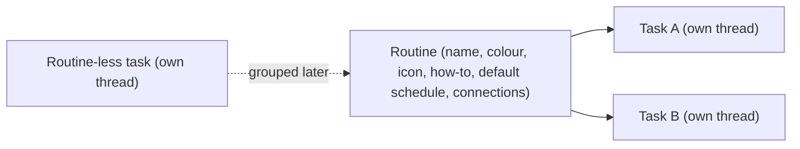

# Assistant View

Assistant View is a top-level view alongside Projects and Chats. It holds
**routines** and **tasks**, schedules agent runs, and hands task threads off to
projects. This document is the contract for the assistant model, the scheduler,
the missed-run surfaces, the how-to authoring flow, and fork hand-off.

## Model

- **Routine** is the group ("Triage CodeInOven PRs daily, 9am and 5pm"). It owns
  the agent-authored how-to, a default schedule, and connection picks. Type:
  `src/lib/types/routine.ts`; persisted in the `routines` table via
  `src/main/database/repositories/routine-repo.ts` and managed by
  `src/lib/engines/routine-manager.ts`.
- **Task** is a thread in the hidden assistant space container
  (`ASSISTANT_SPACE_ID`, `src/lib/types/project.ts`) with an optional
  `routineId`. One continuous thread per task; a task may exist without a
  routine. Assistant threads are excluded from Projects and Chats because the
  container is a hidden project, exactly like the inbox.
- **Hierarchy is always Routine -> Task -> one continuous thread per task.**
  Each task may override its routine's schedule (`scheduleOverride`), and shows a
  custom icon (`assistantIconType`) on its row.

### V1 pillars

1. Core view + how-to panel (`src/renderer/lib/components/assistant/`).
2. Main-process scheduler with missed-run detection
   (`src/main/scheduler/routine-scheduler-service.ts`).
3. Agent-authored how-to flow (in-thread authoring, `/save-how-to`).
4. Fork hand-off to a project (`AssistantHandoffControl.svelte`).

### Explicitly deferred

Thread-per-run, automatic catch-up of missed schedules, a standalone Task
entity, a new `threadKind` flag, hand-off by move (not fork), and a permanent
general assistant chat. The header's **New task** action creates a routine-less
task instead, and creates it with no extra naming step.

### Workspace

A routine behaves like a project, so its tasks run inside the routine's own
workspace instead of a shared scratch directory:

- The assistant container itself is hidden with no path, like the inbox. When a
  session needs a directory, `resolveProjectPath`
  (`src/main/chat/chat-engine.ts`) maps it to the app-storage root
  `assistant-cwd/`.
- `resolveThreadPath` then scopes every assistant thread to
  `assistant-cwd/<routineId>/`, so work in one routine can never touch another's
  files. A routine-less task gets `assistant-cwd/<threadId>/`.
- That routine directory is the session's working directory and its permission
  project root, so artifacts, generated images, and any files the agent writes
  land under the routine. Assistant threads get no `chats-artifacts` scratch
  path, and `assistant-cwd` is registered as an app artifact root so the
  renderer can show those files.
- Directory constants live in `src/lib/project-artifacts.ts`
  (`ASSISTANT_CWD_DIR`, `CHATS_CWD_DIR`) and are pre-created by
  `src/main/storage/storage-engine.ts`.

## Scheduler contract

`RoutineSchedulerService` (`src/main/scheduler/routine-scheduler-service.ts`) is
the app's clock for Assistant View.

- **App-open-only firing.** A bounded 30s tick evaluates each scheduled task.
  A slot that comes due while the app is open dispatches one run on the task's
  continuous thread, using the task's bound settings and the routine how-to as
  prompt context (`sendPrompt` with `origin: 'internal'`).
- **No auto catch-up.** A slot that came due while the app was closed (or a
  machine slept through it) is recorded as a missed run, never run in a burst.
  The grace window is `MISS_GRACE_MS`; a fire before process start is always a
  miss.
- **Missed-run persistence.** `MissedRunStore`
  (`src/main/scheduler/missed-run-store.ts`) writes
  `scheduler/missed-runs.json` through the storage engine. Records are
  idempotent by `(threadId, dueAt)`, so repeated relaunches cannot
  double-count or double-badge one miss.
- **Dismiss vs Run Now.** `assistant:dismissMissedRun` acknowledges a record
  without running it; `assistant:runMissedRunNow` dispatches the run on the task
  thread and settles the record on success. Neither is automatic.

## Missed colour token

The missed surfaces use a dedicated token, never `--color-warning` (`#d97706`),
and never `#ffe300` verbatim (it fails text contrast on light surfaces).

| Theme                                      | Token            | Value     | Contrast                             |
| ------------------------------------------ | ---------------- | --------- | ------------------------------------ |
| Light (`@theme` in `src/renderer/app.css`) | `--color-missed` | `#a16207` | ~4.9:1 on `#ffffff` (AA normal text) |
| Dark (`.dark` in `src/renderer/app.css`)   | `--color-missed` | `#fcd34d` | ~13.6:1 on `#0b0b0d`                 |

The token joins the other thread tones in `STATUS_TONE_COLORS`
(`src/renderer/lib/stores/scope-board.ts`) as `missed: 'var(--color-missed)'`,
with the tone added to `ThreadStatusTone`
(`src/lib/thread-status-policy.ts`). No thread status maps to it: it exists only
for assistant scheduled runs. `StatusBadge.svelte` resolves it automatically.

## Missed-run surfaces

Missed runs are surfaced **per routine**: a routine's surfaces list every miss
across its tasks, and a routine-less task lists only its own. Nothing appears
until a run has actually been missed, so no tab or filter chrome exists by
default:

- the **Missed runs tab** in the how-to panel, present only when the panel's
  routine (or task) has a miss (`missedTabVisible`); until then the panel is a
  single read-only how-to view;
- the **missed badge** on the routine row (when any child task has a miss) and on
  the specific missed task row;
- the **Missed Runs section** of the notification panel (`Assistants` tab),
  grouped per routine, with per-entry **Dismiss** and **Run now** actions. The
  Assistants tab exposes no sub-filter buttons; with no miss it shows only a
  neutral empty state.

The renderer state lives in `assistantRoutines`
(`src/renderer/lib/stores/assistant-routines.svelte.ts`), fed by the
`routine:changed` and `assistant:missedRunsChanged` events.

## Assistant sidebar

The left sidebar shows only routines and their tasks, with no title header and
no composer. Everything the view offers lives on the app header, registered by
the workspace through `viewActions`:

- **Search** (`AssistantSearchControl.svelte`) filters routines and tasks.
- **New routine** (`RoutineCreateControl.svelte`) names a routine and
  immediately seeds its first task, exactly as adding a project opens a first
  thread; the how-to panel opens next.
- **New task** creates a task, and is routine-aware: when the user is inside a
  routine (the selected task belongs to one, or its how-to panel is docked) the
  task is created inside that routine; otherwise it is routine-less.

Keyboard shortcuts mirror the header actions and are scoped to the Assistant
view, so they never steal the chords from Projects or Chats:

- **Cmd/Ctrl+N** — new task (inside the routine the user is currently in, else
  routine-less).
- **Cmd/Ctrl+Shift+N** — new routine, always.

Both signals travel through `workspaceState.requestAssistantTask()` and
`requestAssistantRoutine()` and are consumed by the workspace, which owns the
routine-aware creation logic.

Routine rows (`AssistantRoutineRow.svelte`) follow the project folder row: the
icon swaps to a chevron on hover, and hover reveals a search-in-routine control,
a new-task button, and an ellipsis menu (also opened by right-clicking the row)
with How to, Edit routine, Pin/Unpin, and Remove. Rows are draggable to reorder, and a
task dragged onto a routine is grouped into it. Hovering a routine reveals a
popover with its status, schedule type, next run, task count, and a how-to
preview (`AssistantRoutineHoverPopover.svelte`).

Routines are editable exactly like projects: **Edit routine**
(`RoutineEditModal.svelte`) opens the shared `AppearancePicker` for the accent
colour and SVG icon, an **Upload Image** action for a custom icon, and the
routine name. Custom icons are stored under `routines/<routine-id>/` through the
shared `src/lib/icon-file.ts` helpers (the same ones project icons use), served
back by `routine:getIcon`, and cached on `assistantRoutines.iconUrls`. A routine
row resolves its icon as custom image, then SVG icon type tinted with the accent
colour, then the generic routine icon; the accent colour stays as the row's left
border.

Task rows (`AssistantTaskRow.svelte`) behave exactly like thread rows. Hovering
reveals an ellipsis (overlaid, so the title truncates at the full row width)
whose menu is the shared `createThreadActionsMenu`: Rename, Pin/Unpin, Fork,
Notes, Copy thread id, and Delete. Right-clicking the row opens the same menu,
a long press opens it on touch, and hovering shows the regular
`ThreadHoverPopover` (with the hidden assistant container's project rows
suppressed via `hideProject`). A new task is created already inside its routine
(`routineId` travels through `thread:create`), so the creation broadcast can
never leave it stranded outside the routine.

The how-to panel opens in the right context sidebar from the rail's **How to**
toggle or a routine's **How to** menu item. The assistant rail is deliberately
minimal: for an assistant thread it carries only **History** and **How to**,
never terminal, actions, files, memory, or cloud tools.

## How-to authoring

Every routine has a required how-to. The UI **never** uses the term "system
prompt"; the user-facing term is how-to.

- A routine with an empty how-to shows an amber **Incomplete** icon
  (`AlertTriangle`, `--color-warning`) whose meaning is revealed on hover
  (`routineHowToComplete`); the missed state uses the same icon in
  `--color-missed`. Routine rows never carry the state as text, and the badge
  shares the second row with the task count.
- The how-to is authored conservatively in the routine's task thread, never in
  a panel. The first task's head start asks _how the routine should happen_ and
  the user describes it; the agent works out what it needs, asks about anything
  missing, and drafts the how-to with them. Only once both agree does the agent
  present the final how-to in a fenced `how-to` block and ask the user to send
  `/save-how-to`, which commits it to the routine.
- The how-to panel (`HowToPanel.svelte`) is **read-only**: it renders the saved
  how-to, and only once a how-to exists the routine schedule, the task schedule,
  and the connections. With no how-to it is a single empty state and nothing
  else, so an unconfigured routine never shows schedule or hand-off chrome. Its
  tab strip only appears once a scheduled run was actually missed, and the
  Missed runs tab lists each miss of that routine with Dismiss and Run now.
- When a routine lacks the utilities it needs, the agent checks the app utility
  library, researches compatible skills/MCPs/plugins, and asks the user to send
  `@cio-utility proceed` before anything is installed. No silent installs; the
  only acceptable blockers are network and a closed app.

## Fork hand-off

`AssistantHandoffControl.svelte` forks a task thread into a chosen project via
`thread:fork` (`src/lib/engines/thread-manager-fork.ts`), reusing the
`ContinueInProjectModal` picker. The fork is seeded with a context summary
(recorded with `history:append`), and the original task thread and its schedule
stay intact. Handing off while the task is mid-run always passes a confirmation
dialog first, so a concurrent write cannot corrupt the thread session.
